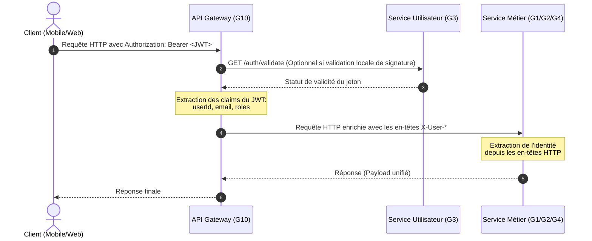

# SGITU — Structure du Payload Généralisé & Maintenance

Ce document définit les normes d'interopérabilité et la structure des payloads généralisés échangés au sein de l'écosystème **SGITU** (Système de Gestion Intégrée des Transports Urbains). Il sert de guide de maintenance technique pour les développeurs des groupes **G1 (Billetterie)**, **G2 (Abonnement)**, **G3 (Utilisateur)**, et **G4 (Coordination des Transports)**.

---

## 1. Objectifs & Cinématique Globale

Dans une architecture microservices, l'**API Gateway (G10)** agit comme l'unique point d'entrée. Elle valide le jeton JWT signé par le **Service Utilisateur (G3)**, extrait l'identité de l'utilisateur, puis propage cette information sous forme d'**en-têtes HTTP standardisés** vers les services métiers.

### 1.1. Sign-Out et validité du token côté serveur

Le jeton d'accès JWT est émis avec une expiration fixe. Pour assurer un vrai **sign-out**, le Service Utilisateur (G3) maintient une liste noire des jetons révoqués dans **Redis**. Lors de la déconnexion (`POST /auth/logout`), le token est stocké dans Redis jusqu'à la fin de sa durée de vie restante. Toute requête entrante ultérieure est alors refusée même si le token n'est techniquement encore pas expiré.

### 1.2. Extraction des claims et propagation vers G1/G2/G4

L'API Gateway (G10) n'a pas besoin de revalider l'ensemble du contenu métier : elle récupère les claims essentiels du JWT (`userId`, `email`, `roles`) et les transforme en en-têtes HTTP sécurisés pour les services métiers. Cela garantit que les groupes **G1, G2 et G4** reçoivent toujours la même identité et les mêmes autorisations.



---

## 2. En-têtes HTTP de Propagation de Contexte

Afin de garantir la traçabilité et la sécurité sans forcer chaque microservice à valider à nouveau le JWT, la Gateway injecte systématiquement les en-têtes suivants dans toutes les requêtes dirigées vers les microservices internes :

| En-tête HTTP | Type | Description | Exemple |
| :--- | :--- | :--- | :--- |
| `X-User-Id` | Long | Identifiant unique de l'utilisateur dans la base G3 | `42` |
| `X-User-Email` | String | Email de l'utilisateur authentifié | `jean.dupont@etu.univ.fr` |
| `X-User-Roles` | String | Rôles de l'utilisateur (séparés par des virgules) | `ROLE_PASSENGER,ROLE_STUDENT` |
| `X-Correlation-Id` | UUID | Identifiant unique de requête pour le traçage distribué | `f81d4fae-7dec-11d0-a765-00a0c91e6bf6` |

---

## 3. Structure Unifiée des Réponses d'Erreur

Tous les microservices (G1, G2, G3, G4) doivent adhérer à la même structure de payload en cas d'erreur. Cela permet à l'API Gateway (G10) et aux clients de traiter les anomalies de manière uniforme.

### Format JSON d'Erreur (Conforme à RFC 7807)

```json
{
  "timestamp": "2026-05-23T18:10:00.000000",
  "status": 404,
  "error": "Not Found",
  "message": "Ressource introuvable ou accès non autorisé.",
  "path": "/api/users/99"
}
```

### Modèle Java (DTO d'Erreur Standardisé)

```java
package com.sgitu.userservice.dto;

import io.swagger.v3.oas.annotations.media.Schema;
import lombok.AllArgsConstructor;
import lombok.Builder;
import lombok.Data;
import lombok.NoArgsConstructor;

@Data
@Builder
@NoArgsConstructor
@AllArgsConstructor
@Schema(description = "Format standardisé des erreurs retournées par l'écosystème SGITU")
public class ErrorResponseDTO {

    @Schema(description = "Horodatage ISO-8601 de l'erreur", example = "2026-05-23T18:10:00.000000")
    private String timestamp;

    @Schema(description = "Code de statut HTTP", example = "404")
    private int status;

    @Schema(description = "Libellé de l'erreur HTTP", example = "Not Found")
    private String error;

    @Schema(description = "Message d'erreur descriptif et compréhensible", example = "Utilisateur introuvable avec l'id : 99")
    private String message;

    @Schema(description = "URI de la requête d'origine ayant échoué", example = "/api/users/99")
    private String path;
}
```

---

## 4. Guide d'Implémentation & Exemples de Code

### A. Extraction des En-têtes dans les Services Métiers (G1, G2, G4)

Pour récupérer l'identité de l'utilisateur dans vos contrôleurs Spring Boot, utilisez l'annotation `@RequestHeader` :

```java
@RestController
@RequestMapping("/tickets")
public class TicketController {

    @PostMapping("/buy")
    public ResponseEntity<TicketResponse> buyTicket(
            @RequestHeader("X-User-Id") Long userId,
            @RequestHeader("X-User-Email") String email,
            @RequestHeader("X-User-Roles") String rolesStr,
            @RequestBody TicketPurchaseRequest request) {

        System.out.println("Achat de ticket initié par l'utilisateur ID: " + userId);
        // Traitement métier de la billetterie (G1)...

        return ResponseEntity.ok(new TicketResponse("SUCCESS", userId));
    }
}
```

### B. Intercepteur pour le Traçage Distribué (Correlation ID)

Pour propager le `X-Correlation-Id` lors des appels HTTP inter-services (via `RestTemplate` ou `WebClient`), utilisez un intercepteur :

```java
import org.springframework.http.HttpRequest;
import org.springframework.http.client.ClientHttpRequestExecution;
import org.springframework.http.client.ClientHttpRequestInterceptor;
import org.springframework.http.client.ClientHttpResponse;
import org.slf4j.MDC;
import java.io.IOException;

public class CorrelationIdInterceptor implements ClientHttpRequestInterceptor {
    @Override
    public ClientHttpResponse intercept(HttpRequest request, byte[] body, ClientHttpRequestExecution execution) throws IOException {
        String correlationId = MDC.get("correlationId");
        if (correlationId != null) {
            request.getHeaders().add("X-Correlation-Id", correlationId);
        }
        return execution.execute(request, body);
    }
}
```

---

## 5. Maintenance & Évolution

1. **Non-modification des en-têtes existants** : Aucun groupe ne doit modifier ou supprimer les en-têtes préfixés par `X-User-` ou `X-Correlation-` sous peine de briser la sécurité globale.
2. **Ajout d'attributs spécifiques** : Si un groupe a besoin d'informations supplémentaires non incluses dans les en-têtes actuels, une demande formelle doit être adressée au groupe G3 pour enrichir le jeton JWT d'origine et la Gateway G10 pour la propagation.

---

## 6. Structure de Payload de Paiement Générique

Pour assurer l'interopérabilité des groupes **G1**, **G2** et **G4** avec le **Service Paiement (G6)**, nous définissons un modèle de payload générique commun.

### 6.1. Champs obligatoires

| Champ | Type | Description |
| :--- | :--- | :--- |
| `paymentId` | String | Identifiant unique de la transaction de paiement |
| `userId` | Long | Identifiant de l'utilisateur à l'origine du paiement |
| `amount` | Decimal | Montant du paiement |
| `currency` | String | Devise ISO 4217 (`EUR`, `USD`, etc.) |
| `paymentMethod` | String | Méthode de paiement (`CARD`, `MOBILE_MONEY`, `WALLET`, etc.) |
| `status` | String | Statut de la transaction (`PENDING`, `COMPLETED`, `FAILED`) |
| `timestamp` | String | Horodatage ISO-8601 de la création du paiement |
| `sourceService` | String | Service initiateur (`G1`, `G2`, `G4`) |
| `metadata` | Object | Informations complémentaires métier (ex : `ticketId`, `subscriptionId`) |

### 6.2. Exemple JSON de payload générique

```json
{
  "paymentId": "pay_20260603_0001",
  "userId": 42,
  "amount": 12.50,
  "currency": "EUR",
  "paymentMethod": "CARD",
  "status": "PENDING",
  "timestamp": "2026-06-03T14:12:00Z",
  "sourceService": "G1",
  "metadata": {
    "ticketId": "ticket_1234",
    "route": "Ligne 5"
  }
}
```

### 6.3. Consignes pour les groupes métiers

- **G1 (Billetterie)** : remplit `sourceService = "G1"` et `metadata.ticketId`.
- **G2 (Abonnement)** : remplit `sourceService = "G2"` et `metadata.subscriptionId`.
- **G4 (Coordination)** : remplit `sourceService = "G4"` et ajoute un contexte d'itinéraire si nécessaire.

Cette structure commune facilite l'analyse, la facturation et l'envoi de notifications dans tout l'écosystème.

---

## 7. Publication d'événements asynchrones

Le Service Utilisateur (G3) publie des événements vers Kafka pour garantir la dissociation des responsabilités :

- `WELCOME` pour l'envoi d'un email de bienvenue via le Service Notification (G5)
- `EMAIL_VERIFICATION` pour la vérification du compte utilisateur
- `ACCOUNT_DEACTIVATED` pour les actions de sécurité et les alertes de gestion

Ces événements sont publiés de manière asynchrone, ce qui permet de ne pas bloquer les parcours utilisateur critiques et de conserver une interopérabilité propre entre les services.

Lorsque la publication Kafka échoue, G3 met en file d'attente les événements en base et les réessaie périodiquement via un scheduler. Cela forme un mécanisme de validation/batching résilient garantissant que les notifications et les analytics finissent par être délivrés sans casser l'architecture globale.