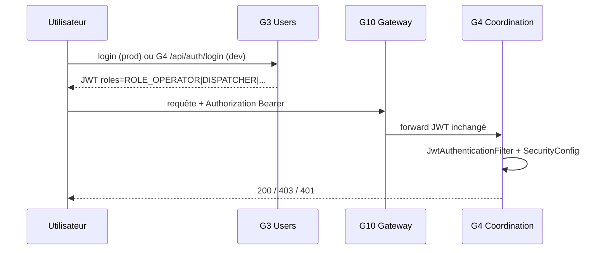

# Sécurité end-to-end — G4

## Chaîne complète (G3 → G10 → G4)

## Filtrage local des rôles (obligatoire prof)

G4 **ne fait pas confiance aveugle** à G10 : chaque requête est re-vérifiée dans `SecurityConfig.java`.

| Rôle JWT (G3) | Écriture réseau | Écriture flotte | Supervision |
|---------------|:---------------:|:---------------:|:-----------:|
| `ROLE_OPERATOR` | Oui | Non | Non |
| `ROLE_DISPATCHER` | Non | Oui | Non |
| `ROLE_ADMIN_G4` | Oui | Oui | Oui |
| `ROLE_ADMIN` | Oui | Oui | Oui |

Endpoints **`/api/g4/incident-impacts`** : même règle que missions/événements (DISPATCHER+).

## Endpoints publics (sans JWT)

- `POST /api/auth/login` (dev)
- `GET /api/g4/health`
- `GET /api/g4/logs`
- Swagger / OpenAPI
- `GET /actuator/health`

## Secret JWT partagé

Variable : `SGITU_JWT_SECRET` — **identique** sur G3, G10 et G4 en intégration.

## Preuves à capturer (validation croisée prof)

1. Login → token avec rôle visible (decode jwt.io)
2. `GET /api/g4/missions` avec Bearer → **200**
3. DISPATCHER tente `POST /api/g4/lignes` → **403**
4. OPERATOR tente `POST /api/g4/missions` → **403**
5. (Optionnel) Token G10 → appel G4 via gateway

Tests automatisés : `SecurityRolesIntegrationTest.java`.

## Comptes démo (dev uniquement)

| User | Rôle |
|------|------|
| gestionnaire.reseau | OPERATOR |
| gestionnaire.flotte | DISPATCHER |
| admin.technique | ADMIN_G4 |

Mot de passe : `password`
